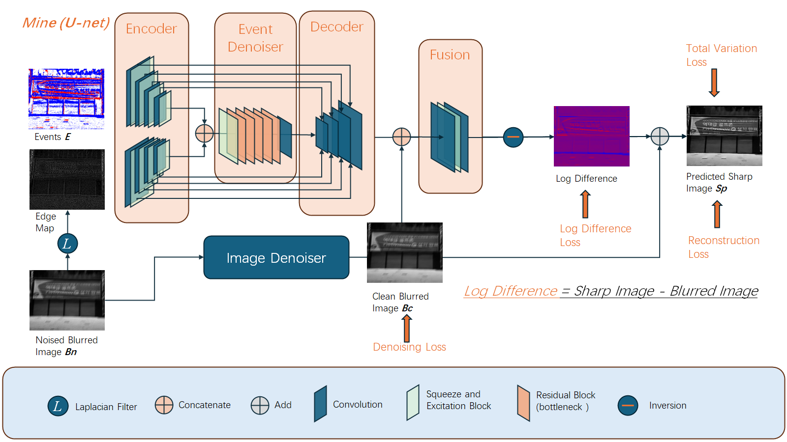
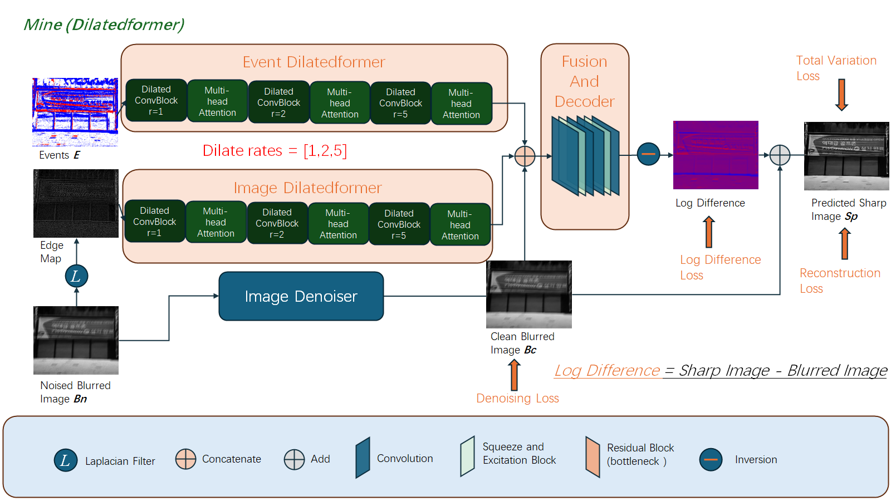

## Announcement
The code is heavily based on the project [Deblurring-Low-Light-Images-with-Events
](https://github.com/fourson/Deblurring-Low-Light-Images-with-Events/tree/master) By [Chu Zhou](https://fourson.github.io/), Minggui Teng, Jin Han, Jinxiu Liang, Chao Xu, Gang Cao, [Boxin Shi](http://ci.idm.pku.edu.cn/)
I modifed loss_full model_full networks train_full and other files for academic purposes.

## U-Net network

## Dilatedformer network
